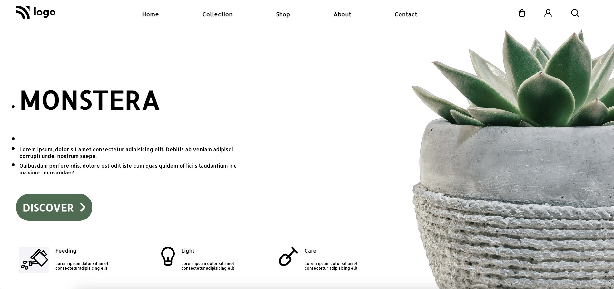

# HTML CSS Project-5 at Intecons

## About the Project :-

>1) The project is based on **HTML and CSS**.

>2) This project is a part of Styling Challenge Series.

>3) **Prominent CSS properties** used are _flex_ and _position_.

## Project _**ScreenShot**_ :-

## Project Link :-

